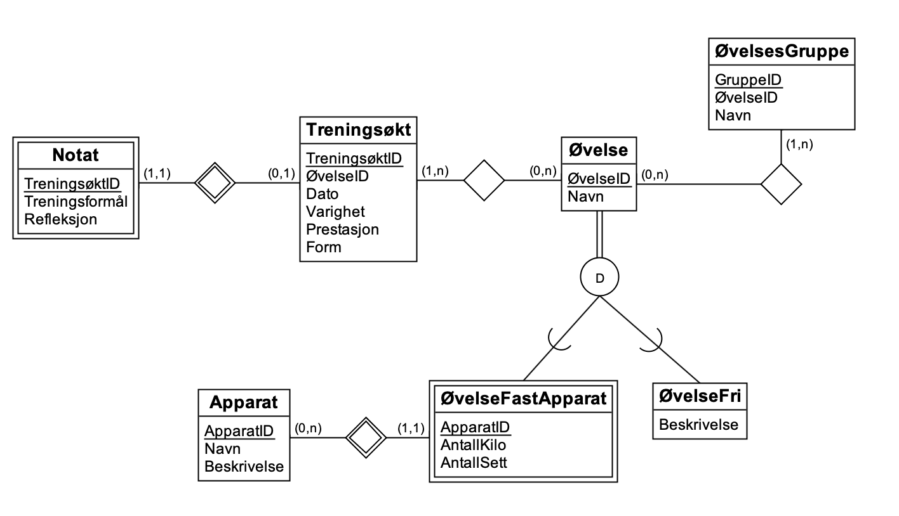

---
title: "Innlevering 1: Konseptuell datamodell"
author: [Iver Håkonsen, Kristian Hardang, Isak Collett]
date: "27.02.19"
lang: "nb"
header-includes: |
    \usepackage{dashundergaps}
...

## ER-diagram

## Relasjonsdatabasemodell
* **Treningsøkt**( \underline{TreningsøktID} , Dato, Varighet, Prestasjon, Form)
* **Øvelse**( \underline{ØvelseID} , Navn)
    * ØvelseID fremmednøkkel til Treningsøkt
* **ØvelseApparat**( \underline{ØvelseID}, \dashuline{ApparatID}, AntallKilo, AntallSett)
    * ØvelseID fremmednøkkel til Treningsøkt, ApparatID fremmednøkkel til Apparat.
* **ØveleseFri**(\underline{ØvelseID}, Beskrivelse)
    * ØvelseID fremmednøkkel til Treningsøkt.
* **ØvelseIØkt**( \underline{TreningsøktID, ØvelseID})
    * TreningsøktID fremmednøkkel til Treningsøkt, ØvelseID fremmednøkkel til Øvelse.
* **Notat**( \dashuline{TreningsøktID} , Treningsformål, Refleksjon)
    * TreningsøktID fremmednøkkel til Treningsøkt.
* **Apparat**(\underline{ApparatID} , Navn, Beskrivelse) 
* **ØvelsesGruppe**(\underline{GruppeID}, Navn}
* **ØvelseIGruppe**(\underline{GruppeID, ØvelseID})
    * GruppeID fremmednøkkel til ØvelsesGruppe, ØvelseID fremmednøkkel til Øvelse.

## Beskrivelse av krav 
1. Registrere apparater, øvelser og treningsøkter med tilhørende data:
    * Et apparat kan registres uavhengig av alt annet, siden det ikke er en svak klasse.  
      Dersom øvelsen bruker fast apparat, kan denne referes til, og en øvelse kan dermed 
      opprettes. En treningsøkt kan også opprettes uavhegig. Når både øvelsen og treningsøkten
      er opprettet, kan id'ene settes inn i `ØvelseIØkt`.
2. Få opp informasjon om et antall _n_ sist gjennomførte treningsøkter med
   notater, der n spesifiseres av brukeren:
    * Siden treningsøktene har en dato, kan man sortere treningsøktene etter dette og velge  
      de _n_ første. 
      
3. For hver enkelt øvelse skal det være mulig å se en resultatlogg i et gitt
   tidsintervall spesifisert av brukeren:
    * 

4. Lage øvelsesgrupper og finne øvelser som er i samme gruppe:
5. Et valgfritt use case som dere selv bestemmer:

## SQL-skript

